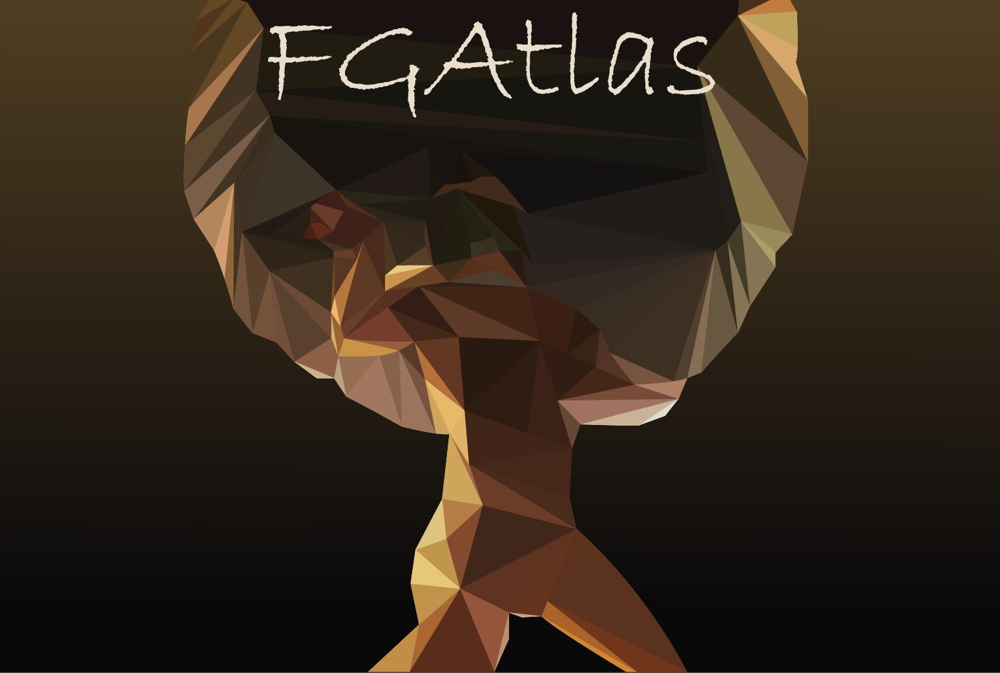

# 2022-2-Squad04 - FGAtlas

<a name="readme-top"></a>

[![Contributors][contributors-shield]][contributors-url]
[![Forks][forks-shield]][forks-url]
[![Issues][issues-shield]][issues-url]
[![MIT License][license-shield]][license-url]

<!-- PROJECT LOGO -->
<br />
<div align="center">
  <a href="https://github.com/othneildrew/Best-README-Template">
    
  </a>

  <h3 align="center">FGAtlas</h3>

  <p align="center">
    Um incrível mapa para se localizar na FGA!
    <br />
    <a href="https://github.com/fga-eps-mds/2022-2-FGAtlas/issues">Reportar Bug</a>
    ·
    <a href="https://github.com/fga-eps-mds/2022-2-FGAtlas/issues">Recomendar Feature</a>
  </p>
</div>


<!-- TABLE OF CONTENTS -->
<details>
  <summary>Conteúdo</summary>
  <ol>
    <li>
      <a href="#Sobre-o-projeto">Sobre o projeto</a>
      <ul>
        <li><a href="#Tecnologias">Tecnologias</a></li>
      </ul>
    </li>
    <li><a href="#Como-rodar">Como rodar</a></li>
    <li><a href="#Backlog-do-produto">Backlog do produto</a></li>
    <li><a href="#Devenvolvedores">Desenvolvedores</a></li>
    <li><a href="#Como-contribuir">Como contribuir</a></li>
    <li><a href="#licença">Licença</a></li>
  </ol>
</details>


<!-- ABOUT THE PROJECT -->
## Sobre o projeto

FGAtlas é um projeto web que fornece a localização dos prédios e salas da FGA, a fim de auxiliar calouros e veteranos a encontrarem os locais onde terão suas aulas. A ideia surgiu após a equipe realizar, em grupos da faculdade, uma pesquisa via forms na qual questionava os estudantes qual era a maior dificuldade dos mesmos no campus, a grande parte das respostas foram direcionadas à questões envolvendo localização. 

<p align="right">(<a href="#readme-top">Voltar</a>)</p>

## Tecnologias

Tecnologias utilizadas neste repositório:


<p align="right">(<a href="#readme-top">Voltar</a>)</p>

<!-- GETTING STARTED -->
## Como rodar
Para executar o backend:
1.	Instale o node.js 

2.	Instale o docker 

3.	Clone o repositório
	
4.	Crie o container no docker para a aplicação
	
5.	Execute no terminal: 

```
npm run migrate_dev
```

6.	Execute no terminal: 

```
npm run scrap
```

7.	Execute no terminal: 

```
npm run start
```

Para executar o frontend:
1. Vá para a pasta do vite
2. Execute no terminal:

```
npm run dev
```
<p align="right">(<a href="#readme-top">Voltar</a>)</p>

## Backlog do produto

<p align="right">(<a href="#readme-top">Voltar</a>)</p>

## Desenvolvedores

<center>
<table style="margin-left: auto; margin-right: auto;">
    <tr>
        <td align="center">
            <a href="https://github.com/ccarlaa">
                
                <h5 class="text-center">Carla Clementino</h5>
            </a>
        </td>
        <td align="center">
            <a href="https://github.com/deboracaires">
                
                <h5 class="text-center">Debora Caires</h5>
            </a>
        </td>
        <td align="center">
            <a href="https://github.com/bot-do-jao">
                
                <h5 class="text-center">João Pedro</h5>
            </a>
        </td>
        <td align="center">
            <a href="https://github.com/kaua-pt">
                
                <h5 class="text-center">Kauã Vinícius</h5>
            </a>
        </td>
        <td align="center">
            <a href="https://github.com/Lizdtre">
                
                <h5 class="text-center">Paulo Renato</h5>
            </a>
        </td>
         <td align="center">
            <a href="https://github.com/StrangeUnit28">
                
                <h5 class="text-center">Rafael Brito</h5>
            </a>
        </td>
	<td align="center">
            <a href="https://github.com/sabrinaberno">
                
                <h5 class="text-center">Sabrina Berno</h5>
            </a>
        </td>
</table>

</center>
<p align="right">(<a href="#readme-top">Voltar</a>)</p>


<!-- CONTRIBUTING -->
## Como contribuir 


<p align="right">(<a href="#readme-top">Voltar</a>)</p>


<!-- LICENSE -->
## Licença

Distributed under the MIT License. See `LICENSE.txt` for more information.

<p align="right">(<a href="#readme-top">Voltar</a>)</p>


<!-- MARKDOWN LINKS & IMAGES -->
[contributors-shield]: https://img.shields.io/github/contributors/fga-eps-mds/2022-2-FGAtlas.svg?style=for-the-badge
[contributors-url]:https://github.com/fga-eps-mds/2022-2-FGAtlas/graphs/contributors
[forks-shield]: https://img.shields.io/github/forks/fga-eps-mds/2022-2-FGAtlas.svg?style=for-the-badge
[forks-url]: https://github.com/fga-eps-mds/2022-2-FGAtlas/network/members
[stars-shield]: https://img.shields.io/github/stars/fga-eps-mds/2022-2-FGAtlas.svg?style=for-the-badge
[stars-url]: https://github.com/othneildrew/Best-README-Template/stargazers
[issues-shield]: https://img.shields.io/github/issues/fga-eps-mds/2022-2-FGAtlas.svg?style=for-the-badge
[issues-url]: https://github.com/fga-eps-mds/2022-2-FGAtlas/issues
[license-shield]: https://img.shields.io/github/license/fga-eps-mds/2022-2-FGAtlas.svg?style=for-the-badge
[license-url]: https://github.com/fga-eps-mds/2022-2-FGAtlas/blob/main/LICENSE
[product-screenshot]: images/screenshot.png

